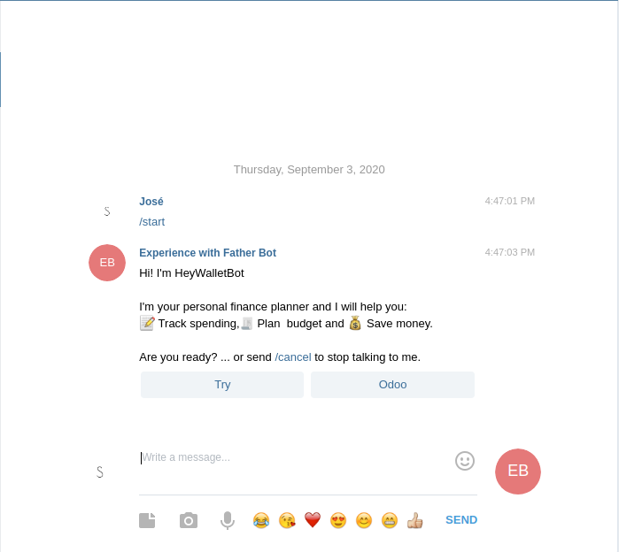
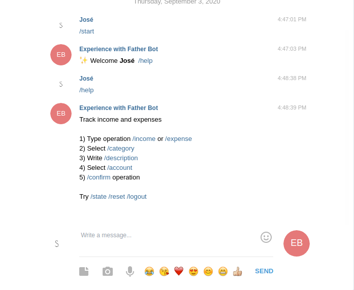
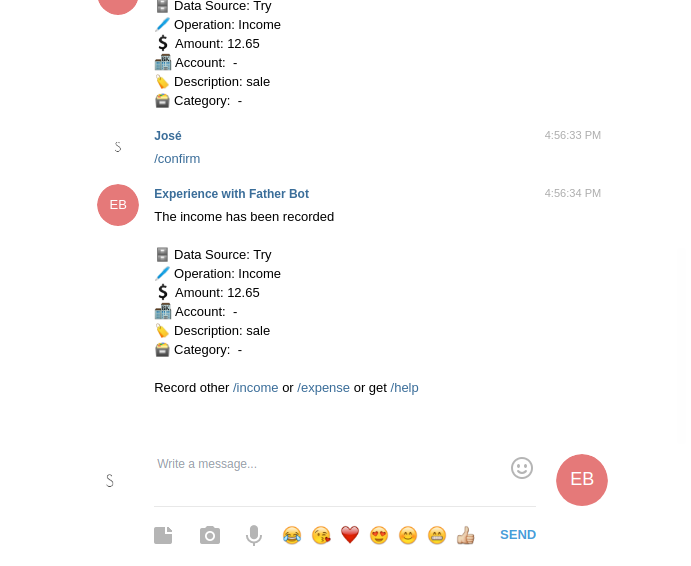

# [Hey Wallet Telegram Bot](t.me/HeyWalletBot)

## [Try: t.me/HeyWalletBot](t.me/HeyWalletBot)

## Intro

It is a part of the HeyWalletBot project that works with financial software (Wallet, ERPs) with public APIs, the objective is to abstract operations and execute in a simple and fast way.

* ✅ Record of income and expenses

* ✅ Select a category or put a description

* ✅ Select a bank or cash account

Any other idea please create an issue

## Connectors 

* ✅ Try (Demo)
* ✅ [Odoo](http://odoo.com/) you need to have the module installed `msb_hey_wallet` contact [maxs.biz](http://maxs.biz/)

## Screenshot







## Docker

```bash
export TELEGRAM_TOKEN=TOKEN && docker-compose up -d
```

## Pipenv 

```bash
pipenv shell 
pip install -r requirements.tx 
export TELEGRAM_TOKEN=TOKEN
python main.py
```

## License

[MIT](LICENSE)