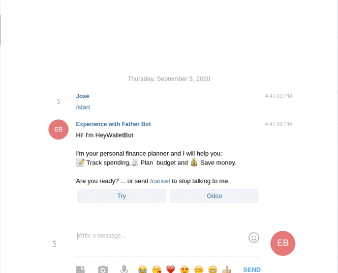

<p align="center">    
  <a href="LICENSE">
    
  </a>
  <a href="semv.toml">
    
  </a>
</p>
<p align="center">
  <a href="http://t.me/HeyWalletBot">
    
  </a>
</p>

## Hey Wallet for Telegram Bot

It is a gateway that runs on the server to interact with the bot and connects commonly used financial software for to execute operations simply and quickly.

* Record of income and expenses
* Select a category or put a description
* Select a bank or cash account


## Connectors 

* ✅ Try (Demo)
* ✅ [Odoo](http://odoo.com/) you need to have the module installed `msb_hey_wallet`.




## Run own server

### Docker 
```bash
export TELEGRAM_TOKEN=TOKEN && docker-compose up -d
```

### Pipenv 

```bash
pipenv shell 
pip install -r requirements.tx 
export TELEGRAM_TOKEN=TOKEN
python main.py
```